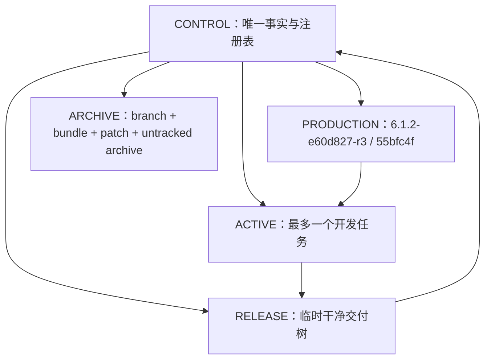

# Worktree 单一控制面方案

> 状态：Executing，Phase 1–2 已完成；3 个 clean worktree 已安全卸载，剩余 13 个历史挂载树待归档。更新时间：2026-08-14。
> 目标：不丢任何成果，把 16 个挂载 worktree 收敛到最多 4 个，并彻底消除“每个分支各写一套线上/发布事实”。

## 根因

Git worktree 共享对象库和分支，但每个 worktree 读取自己分支中的 `AGENTS.md`、`docs/tasks/current.md` 和历史文档。尝试同步所有 worktree 的全局状态必然产生漂移；`current.md` 越详细，冲突越严重。

因此不再把任何业务 worktree 的 `current.md` 当作全项目状态源。全局事实只能由固定控制面维护，业务 worktree 只描述本地任务。

## 最终结构

| 类型 | 数量上限 | 用途 | 可否 dirty |
|---|---:|---|---|
| CONTROL | 1 | 唯一项目状态、release ledger、worktree registry、决策和归档索引 | 仅治理任务期间 |
| PRODUCTION | 1 | 从当前线上客户端源码 `55bfc4f` 创建的只读干净基线 | 否 |
| ACTIVE | 1 | 当前唯一开发任务，从 PRODUCTION 创建 | 可以，但必须登记 |
| RELEASE | 1 | preview/upload/release 临时隔离树，动作结束即归档移除 | 否 |
| PAUSED / ARCHIVED | 0 个挂载 | 以 branch + bundle + patch + untracked archive 保存，不常驻磁盘 | 不适用 |

推荐固定控制面路径为 `D:\projects(WIN)\badminton-miniapp-control`。控制面使用独立 `codex/project-control` branch/worktree；业务分支不得复制全局状态，只链接控制面。

## 控制面只维护五类文件

1. `PROJECT.md`：一屏展示正式线上版本、客户端源码、云端状态和当前活跃任务。
2. `worktrees.json`：每个 worktree 的稳定 ID、path、branch、HEAD、生命周期、dirty 数、产品基准关系、负责人、最后核验时间和备份位置。
3. `release-ledger.jsonl`：upload、review、release、cloud deploy、migration 分事件追加，不覆盖历史。
4. `decisions/`：只追加已接受或被取代的全局决策。
5. `archives/`：每个已卸载 worktree 的 manifest、bundle/patch/untracked 包路径和恢复命令。

`docs/tasks/current.md` 只允许存在于 CONTROL 和 ACTIVE：CONTROL 记录全局当前任务；ACTIVE 最多 30–40 行，只记录本地 scope、HEAD、dirty、测试和下一步。PAUSED 分支中的旧 `current.md` 一律视为历史快照。

## 生命周期与命令合同

控制面提供一个 `worktree-manager`，只从 CONTROL 运行：

- `status`：实时读取 Git，显示线上版本、4 类槽位和漂移，不修改状态。
- `create <task>`：只允许从 PRODUCTION 创建一个 ACTIVE；已有 ACTIVE 时拒绝。
- `pause <id>`：只改 registry，不删除。
- `archive <id> --dry-run`：生成备份计划和预计产物，不删除。
- `archive <id> --execute`：必须有具体路径授权；依次生成 branch bundle、tracked binary patch、untracked archive、SHA-256 manifest，并在临时目录完成恢复验证后才移除 worktree；分支默认保留。
- `release-start`：从确切 commit 创建干净 RELEASE；dirty 或来源不登记时拒绝。
- `release-finish`：写入 receipt 后移除临时 RELEASE，不把它长期保留为另一条开发线。

## 当前 16 个 worktree 的迁移分类

### 暂时保留到控制面建立

- `D:/projects/WIN/badminton-miniapp`：承载本轮治理改动；迁入 CONTROL 后再决定主工作区用途。
- `C:/Users/LIZIXUAN/.codex/worktrees/ba45/badminton-miniapp`：包含线上客户端源码提交 `55bfc4f` 和未跟踪证据；先做完整归档，再用该提交创建干净 PRODUCTION。

### clean，可优先 bundle 后卸载

- `incremental-ui-score-baseline-20260729`
- `local-ops-dashboard`
- `share-activity-collection`

这些 branch 保留；卸载 worktree 不等于删除方案。

### dirty，按成果族归档后卸载

- 截图/文档：`07af/badminton-miniapp`、`a6ba/badminton-miniapp`。
- upload 隔离树：`mp-upload-e60d827`、`upload-e60d827-feedback-r3-badminton-miniapp`；先把 receipt/manifest 并入 CONTROL。
- Next-Gen：`nextgen-design-system`、`nextgen-integration`、`nextgen-typography`、`nextgen-ui-redesign-20260724`；合成一个 Next-Gen archive index，但分别保存 patch/untracked 包。
- 旧打水/组件实验：`standalone-water-a-20260806`、`water-court-vant-spike-20260807`、`water-tdesign-spike-20260807`；按 V1、Vant、TDesign 三份恢复单保存。

## 执行顺序

### Phase 0：冻结扩张

- 不再创建临时 worktree；不再在业务分支维护全局线上和 worktree 清单。
- 正式线上固定为 `6.1.2-e60d827-r3`，客户端源码身份固定为 `55bfc4f`；云端另行盘点。

### Phase 1：建立 CONTROL 与 PRODUCTION

1. 创建 `codex/project-control` 和固定控制面 worktree。
2. 迁移当前治理文档、release receipt 和 worktree registry。
3. 从 `55bfc4f` 创建只读干净 PRODUCTION，并验证 633 文件 manifest。
4. 给新 worktree 的 `AGENTS.md` 安装薄入口：先读 CONTROL，再读本地 task。

### Phase 2：先卸载 clean worktree

对 3 个 clean worktree 创建并验证 bundle，逐路径获得批准后移除 worktree；分支保留。

### Phase 3：归档 dirty worktree

按“截图/文档 → upload 隔离 → 旧打水 → Next-Gen”顺序处理。每棵树都必须生成可恢复四件套并做恢复测试；未验证成功不得移除。

### Phase 4：强制上限

manager 和治理检查共同拒绝：未登记 worktree、第二个 ACTIVE、长期 RELEASE、branch-local 全局线上声明、超过 40 行的 active `current.md`、未备份 dirty 清理。

## 验收标准

- 挂载 worktree ≤ 4，ACTIVE ≤ 1，RELEASE 平时为 0。
- 任意会话只读 CONTROL 即可回答：当前线上、源码身份、云端状态、活跃任务、每棵树是否可删除。
- PAUSED 分支无需同步文档；恢复时以 CONTROL archive manifest 为准。
- 所有 16 棵树都有 registry 记录；所有被卸载的 dirty 树都通过临时恢复验证。
- Git branch、upload、正式 release、cloud deploy 和数据迁移继续分层记录。

## 不采用的方案

- 不继续批量同步所有 worktree 的 `current.md`；它会随分支再次漂移。
- 不把 16 棵树全部 merge 到一个超级分支；这会混入互斥产品路线和未提交实验。
- 不直接删除 dirty worktree 或只保留 patch；必须同时保留 branch bundle、binary patch、untracked archive 和 manifest。
- 不用“最新 upload”替代正式线上，也不用客户端版本推断云端 rollout。
