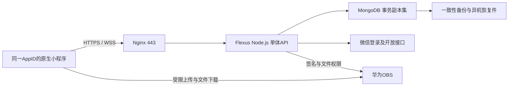

# 华为云迁移方案（暂缓，待重新商榷）

日期：2026-09-11（Asia/Shanghai）。本方案依据当前源码、只读线上盘点和官方资料；不是部署或切流完成证明。

> 最新状态：用户决定方案和计划以后再商榷，当前准备继续现有小程序开发。以下架构、推荐路径和阶段安排仅保留为讨论草案，不是当前执行授权；域名/备案、优惠核验及迁移均不继续推进。[背景与开发接续](session-logs/2026-09-11-migration-paused-development-handoff.md)

## 1. 决策与结论

最新选择：**彻底迁出微信云开发优先；目前没有域名，先准备域名备案，续费一个月过渡。** 后续只读核验发现原环境已于2026-09-11 17:51:31支付19.90元续费成功，有效期至2026-10-12 23:59:59；本助手没有代付。最新[优惠核验](../reports/2026-09-11-cloudbase-discount-verification.md)支持先查成长计划120元券，用户尚未撤销迁出目标。

用户追加要求比较成本：[实时报价与12个月比较](../reports/2026-09-11-cloud-migration-cost-comparison.md)。`.cn`已核实首年38、续费42元/年，备案服务及自部署免费证书无需付费。腾讯原环境实际月价已核实19.90元，迁出主要价值是独立性，现金节省可能不足以抵消改造和运维；不能默认迁移在总成本上最优。浏览器已重连并切换正确账号。

推荐路径：**已有在线备份及一个月续费 → 核验优惠、域名注册/实名/备案与迁移开发并行 → 华为测试恢复/合同回归 → 新客户端审核准备就绪 → 约定维护窗口、全部入口停写、最终快照 → 切换发布 → 华为云成为唯一读写后端。** 过渡期间腾讯仍是生产写入权威，华为测试不写真实业务；不采用跨云双写或长期云函数代理。

目标架构选择原生小程序 + Node.js单体API + MongoDB文档数据库 + 华为云OBS；复用已购买Flexus服务器。保留现有业务算法和数据形态，替换CloudBase运行依赖。暂不同时引入微服务、Kubernetes、Redis或关系数据库重构。

当前已有一个月缓冲，可以核验优惠并继续备案准备和迁移演练。目标是把停服压缩到切换维护窗口，具体维护时长由演练决定；下次到期若不再续费，仍按本方案的到期停服预案保数据。

历史账户短信明确：手动续费资源原定2026-09-12 23:59:59到期，到期1天后停止服务；未给出最终释放精确时刻。**后续订单已将到期日延至2026-10-12 23:59:59**，原9月12日紧急截止已解除。下次仍以实际到期前完成续费或最终保全为目标，不消耗停服缓冲。

腾讯通用文档说明隔离状态下控制台无法访问，超过15天后释放数据，不能将隔离期视为可正常导出的窗口；具体账户生命周期以账户通知为准。[腾讯环境释放说明](https://cloud.tencent.com/document/product/876/55799)

## 2. 已核对事实与未确认项

| 项目 | 事实或边界 |
|---|---|
| 源码 | `D:\projects(WIN)\badminton-miniapp`，branch `codex/online-audit-optimizations-20260828`，HEAD `6827efa3cf00182f4edacaefc5d399d58f82f260`；保留现有脏树 |
| 线上基线 | 以 [current.md](current.md) 为入口；不能把本地Water V2、旧架构文档或历史worktree当作线上开关状态 |
| 云环境 | 通过WechatIDE `cloud_env_list`核实当前项目唯一返回环境；开发/体验/正式源码配置目前指向同一云环境，后续测试必须隔离 |
| 云函数 | 仓库23个，线上只读列表39个；历史16个额外函数也必须盘点归属，不能直接删除 |
| 数据库 | 线上首次盘点16集合、10665条记录；这是在线查询时点计数，备份实绩以独立备份清单为准 |
| 云存储 | 已发现2239对象全部落盘并通过大小/MD5校验；导出数据库的1730唯一云文件引用全部覆盖；其他未引用目录/孤立对象未证明整桶完整 |
| 华为主机 | 2026-08-29记录：广州Flexus、Ubuntu 24.04、2核2GiB、40GiB盘、2Mbit/s峰值带宽，已安装Docker/Compose/Nginx；本轮未重新SSH验证 |
| HTTPS阻塞 | 预备记录中443仍被SSH占用，Nginx只监听80；不能直接接正式小程序API |
| 到期证据 | 2026-09-11既有续费订单成功，实付19.90元，绑定原环境，到期延至2026-10-12 23:59:59；自动续费未开启 |
| 域名 | 用户明确目前没有域名、选择广东省佛山市个人主体；小程序源码名称为“羽球轮转助手” |
| 未确认 | 成长计划领取资格/券适用、域名最终下单结果、微信合法域名配置、AppSecret可用性、真实峰值负载 |

主机依据：[华为Flexus准备记录](../context/huawei-flexus-migration-prep.md)。此文件是历史已验证状态，不替代上线前实测。

## 3. 续费、备案和保全顺序

### 3.0 当前推荐的过渡安排

1. 已只读核验原环境19.90元一个月续费成功、续后到期日2026-10-12；无需重复付款。先查成长计划资格与券适用，任何后续订单另行决定，不误买资源包代替环境续费，也不销毁旧环境。
2. 选择域名并确定备案主体/省份；优先在华为云注册便于管理，但不强制域名注册商。域名所有者实名信息要与备案主体要求相符，敏感证件直接在官方流程填写。
3. 域名注册与实名后，启动华为ICP备案；同时在本地/隔离华为环境开发后端、做数据恢复和回归，不等待备案完成才开始改造。
4. 华为官方说明实名信息入库管局约需三天，建议实名完成至少三天再申请；备案流程预估1–22个工作日，实名审核及材料补正另有耗时。因此“续一个月”只作为第一段过渡预算，不能保证所有外部审核都在一个月内完成。[华为备案流程](https://support.huaweicloud.com/usermanual-icp/zh-cn_topic_0000002127712329.html)、[域名实名说明](https://support.huaweicloud.com/usermanual-domain/domain_ug_320001.html)
5. 在实际续费到期前7天复核备案/审核/迁移状态；是否再续费届时决定，不自动连续续费。本方案没有创建定时提醒或自动执行任务。

之前`wx.cloud`使用平台提供的原生云访问通道，因此项目没有自有API域名；自建广州HTTPS API后需要自己的可用域名与大陆接入备案。小程序本身的备案、服务器域名配置和华为ICP接入是不同事项，不能互相替代。

### 3.0.1 个人主体的域名与备案准备

源码`miniprogram/app.json:46`及`miniprogram/core/shareCard.js:300`的对外名称均为“羽球轮转助手”。2026-09-11已在华为搜索页核实前两项可加入清单：`.cn`首年38/续费42元每年，`.com`首年85/续费95元每年；第三项未核验。可用性随时变化，尚未购买，详见[成本比较](../reports/2026-09-11-cloud-migration-cost-comparison.md)。

| 顺序 | 候选 | 取舍 |
|---|---|---|
| 1 | `yuqiulunzhuan.cn` | 与“羽球轮转”完整拼音对应，作为中国用户小程序的后台域名 |
| 2 | `yuqiulunzhuan.com` | 同名.com备选，不必同时购买两个后缀 |
| 3 | `yuqiuzhushou.cn` | 更通用的“羽球助手”，可能与其他项目撞名，先查注册与名称情况 |

买一个根域名即可规划`api.<域名>`与`assets.<域名>`，这不要求分别购买两个域名。购买前同时核对首年/续费价格、是否溢价、默认附加产品与自动续费选择；用户无名称偏好不等于授权付款。

个人主体准备项：备案省份（按身份证所在地或实际居住地）、本人实名域名、个人证件、手机号/邮箱、实际服务名称与内容、已有华为大陆实例。证件和详细地址直接在华为官方表单输入，不需放入聊天或Git。现有Flexus记录的购买期限看起来覆盖包周期三个月要求，但能否作为备案资源须以华为系统校验为准。[华为备案限制](https://support.huaweicloud.com/icprb-icp/icp_01_0008.html)

用途说明草稿：“羽球轮转助手微信小程序的配套后端，支持羽毛球活动排赛、录分、排名统计及球友打水记录。”提交时按实际运营内容、已有小程序备案情况及省管局规则选择服务类型；不要把多人服务虚填为个人日志。个人主体是否符合实际服务内容由当地规则和华为初审确认。[个人/单位备案区别](https://support.huaweicloud.com/icp_faq/icp_05_0136.html)

用户已选择**广东省佛山市，个人主体**。按广东规则准备有效个人证件、本人实名域名证书、联系方式及官方承诺书；官方模板要求本人签署，具体按备案系统当前模板办理。若证件所在地不在广东，需按规则补充广东有效居住证/房产证明或近三个月社保证明等；不从“居住佛山”推断证件所在地。备案内容如实备注为配套后端，服务类别和个人主体适用性先经华为初审确认。备案通过后按要求提供可访问的服务说明页、展示备案号并链接工信部，核对小程序原备案信息是否需要变更。[广东管局要求](https://support.huaweicloud.com/prepare-icp/icp_02_0021.html)

### 3.1 已授权开展的只读备份

备份根目录：`D:\Relocated\LIZIXUAN\Codex\backups\badminton-cloudbase\2026-09-11`。生产数据不进入Git，不把临时下载签名或密钥写入本方案。

1. 列举全部集合，导出全部字段与原始工具响应，保存集合详情、索引和计数；分页核对重复ID、漏页和实际条数。
2. 下载全部存储对象，保存对象key、fileID映射来源、字节数、哈希及失败清单。根目录空列表或恰好1000条不能视为整桶完整。
3. 保存线上39个云函数清单及能读取的运行状态/超时/运行时；另保存消息推送配置。本机仓库归档只能代表本地源码，不替代线上函数代码包。
4. 额外导出线上函数代码包、环境变量、触发器、安全规则、开放接口权限。当前工具返回的函数摘要只有名称/状态/超时/运行时，不能冒充完整配置备份；无法读取的内容明确留缺口。
5. 校验文件可解析、大小和哈希一致；对数据库进行隔离恢复验证。先保留原始导出，再生成导入格式，不覆盖原件。

CloudBase官方支持集合JSON导出；JSON导出不填写字段项时导出全部字段。嵌套对象和类型恢复需要专门验证，不选CSV作为唯一原始备份。[官方数据库导出说明](https://cloud.tencent.com/document/product/876/19371)

### 3.2 必须区分普通保全与最终快照

当前导出在业务可能继续写入时进行，只能称**在线保全备份**。即使开始/结束条数相同，也不能证明所有集合在同一时点一致。

已续费情况下，最终快照安排在迁移测试及客户端审核准备完成后的维护窗口：确认全部写入口停止、等待在途写入结束，再重导数据库并补齐文件增量，验证条数/ID/业务引用，记录UTC和北京时间。冻结后到核验完成期间不恢复腾讯写入。若最终不续费，则最终快照必须提前到本次到期前完成。

停写必须涵盖当前及历史云函数、客户端直接数据库写权限、云存储上传、触发器/计划任务及管理员脚本；**仅设置Water V2的`emergencyReadOnly`不够**。不要通过销毁环境或先等到隔离来获得“停写”，那样可能失去导出能力。

本轮没有自动修改云权限或部署停写代码。正式停写需先产出覆盖全部入口的可审查变更，再取得该远端变更授权。若最终未续费、也未在到期前完成停写最终快照，必须报告备份完成时刻至停服之间的缺口，不能保证零丢失。

至少保留两份独立故障域的备份：本地校验件，以及用户批准的另一设备或华为云私有备份位置；仅在同一磁盘复制两个目录不算异机备份。向华为上传真实数据仍需明确授权。

### 3.3 线上16个集合

| 类别 | 集合 | 迁移要求 |
|---|---|---|
| 赛事/用户/反馈 | `tournaments`、`user_profiles`、`feedbacks` | 全量保留ID、身份绑定、嵌套成员/排名/头像、时间与版本 |
| 锁与幂等 | `score_locks`、`client_request_logs`、`delete_tournament_requests` | 全量备份；幂等记录随业务导入，旧锁仅留审计，切换后重新获取 |
| Water V1 | `waterSessions` | 保留稳定ID与legacy行为，不趁迁移强制转换生命周期 |
| Water V2 | `waterRooms`、`waterRoomMembers`、`waterRounds`、`waterEntries` | 保留房间/成员/轮次/顺序流水、修改与冲销引用 |
| Water控制 | `waterMigrations`、`water_feature_flags` | 保留迁移记录和线上真实开关，不用源码默认值覆盖 |
| 历史集合 | `relation_data_depart`、`sys_department`、`sys_user` | 先完整归档，再确定调用方和恢复范围，不基于名字删除 |

## 4. 目标架构与成本取舍

“迁出微信云开发”包括业务计算、数据库、文件存储和同步；微信登录、小程序审核/分发、小程序码等微信平台能力仍正常使用，不需要迁出微信小程序。

| 方案 | 判断 |
|---|---|
| **Flexus + 自建MongoDB副本集 + OBS** | 本个人项目的默认方案，文档形态接近当前实现、新增成本较少；需自行维护数据库和备份。单节点副本集只提供事务能力，不提供高可用 |
| Flexus + 华为DDS副本集 + OBS | 若需要数据库故障自动切换或不愿自维护，优先选此方案；预算、目标版本事务兼容、广州可售规格和网络需要购买前核验 |
| PostgreSQL/JSONB | 可实现事务，但需额外重写查询和更新映射，本次不同时切数据模型 |
| 仅把函数搬到FunctionGraph或用腾讯函数转发 | 不能替代身份、数据库、watch和存储迁移；跨云代理还不满足彻底迁出目标 |

MongoDB事务要求副本集或分片集群；不能用普通standalone容器或假事务包装代替。驱动版本与数据库版本固定并通过真实事务测试后再用于生产。[MongoDB事务文档](https://www.mongodb.com/docs/manual/core/transactions/)

先用现有2GiB主机进行恢复和压力测试，设置数据库缓存、进程内存与日志限额，并确保备份执行时仍有余量；不过线再升级到4GiB或使用DDS。2GiB swap不等同于可用内存，不能仅凭空载容量承诺可承载正式业务。

图片从OBS直接下载，避免占用主机2Mbit/s出口。作为容量示例，100人每1.5秒拉一次20KB全量文档约需10.7Mbit/s，已超过套餐峰值；这只是计算示例，不是实测负载。同步应优先发轻量变更通知、按版本拉取，压测确认后决定带宽。

若使用DDS，Flexus L默认VPC不可任意更换；同地域同账号可让DDS进入兼容VPC或配置有效对等连接，不能假设“同在广州即互通”。禁止为省配置将数据库直接暴露公网。[华为L实例内网连通性](https://support.huaweicloud.com/flexusl_faq/faq_network_0004.html)

费用预算采用账单项：腾讯一个月过渡续费 + 现有华为主机余期 + 可能的升配差价 + OBS容量/请求/出网 + 备份容量 + 域名；自部署Let's Encrypt证书免费，DDS为可选独立大项。广州OBS实价与不同下载用量的估算见[成本比较](../reports/2026-09-11-cloud-migration-cost-comparison.md)。现有主机到期前的新增购置费为0不等于长期免费；迁移后的用量仍待验证。腾讯一个月已由账户既有订单付款，尚未购买华为新增资源。

## 5. 最小必要改造

| 边界 | 改造内容 | 保持不变的业务合同 |
|---|---|---|
| 统一调用 | `core/cloud.js`从`wx.cloud.callFunction`改为认证HTTPS；保留函数名/action到服务端handler的映射 | `{ok,code,message,state,traceId,data}`、冲突/超时/权限分类、仅安全读取自动重试 |
| 登录 | `wx.login` code由后端向微信换身份，签发自有会话；服务端从会话得到OpenID，不接受客户端自报身份 | 同一AppID与现有OpenID绑定，房主/裁判/参与者/Water成员权限 |
| 数据层 | CloudBase查询、条件更新、删除字段、服务端时间、分页和事务逐项改为原生MongoDB操作 | `_id`保持原类型、版本CAS、幂等日志、Water多文档原子性 |
| 直读与同步 | 替换`sync/watch.js`、`core/tournamentSync.js`、home直接读库；WSS发变更通知，HTTP拉取权威文档；保留认证HTTP轮询恢复 | 版本防倒退、删除终态、隐藏停止、恢复前台刷新、页面订阅释放；实测同步时效 |
| 文件 | OBS受限上传/私有访问策略；旧fileID通过迁移映射解析为华为文件，不再向腾讯取URL | 历史头像、分享卡、嵌套头像引用及本地缓存仍能显示；不持久化即将过期的签名URL |
| 开放接口 | 替换`cloud.openapi`：小程序码、动态消息activityId及消息更新，由后端维护微信access token | 既有分享权限；消息更新失败不得反向撤销已成功的业务写入 |
| 初始化和环境 | 移除`app.js`的CloudBase强依赖；开发/体验/正式指向独立API/数据库/存储前缀 | 原页面、路由、CTA与产品能力边界 |

不要构建通用CloudBase模拟平台。保留现有纯业务模块，将数据库操作按实际用到的查询和更新明确迁移；每个handler的权限和错误返回有直接合同验证。

主要源码证据：`miniprogram/core/cloud.js:504`；`miniprogram/app.js:20`；`miniprogram/sync/watch.js:97/177/312/348`；`miniprogram/core/tournamentSync.js:78`；`miniprogram/pages/home/index.js:411`；`miniprogram/core/profile.js:108`；`cloudfunctions/waterSession/index.js:13/495/1609/1861`。

OBS支持后端生成表单上传签名。小程序实现时要核对`wx.uploadFile`实际表单字段、文件大小/MIME限制、路径归属、HTTPS域名和真机下载；不把云AK/SK发给客户端。[OBS表单上传文档](https://support.huaweicloud.com/sdk-nodejs-devg-obs/obs_29_0412.html)

微信登录和网络规范入口：[code2Session](https://developers.weixin.qq.com/miniprogram/dev/OpenApiDoc/user-login/code2Session.html)、[网络能力](https://developers.weixin.qq.com/miniprogram/dev/framework/ability/network.html)。本轮官方页面抓取失败，生产接入前需以微信后台及当前官方文档再核对域名/接口要求，不能把开发工具“不校验域名”当作验收。

## 6. HTTPS、部署与运维

1. 核对域名及ICP备案/接入备案条件。广州是大陆节点；备案与微信审核都是外部依赖，不能承诺明天完成。[华为备案准备](https://support.huaweicloud.com/qs-icp/ICP%E5%BF%AB%E9%80%9F%E5%85%A5%E9%97%A8.pdf)
2. 先开通并实测受限SSH管理入口和VNC救援，再解除SSH对443的占用；之后配置Nginx证书、HTTPS和续期。不要先关闭唯一可达管理通道。
3. 应用与数据库通过Compose部署，数据库不映射公网端口；Nginx只代理应用。密钥留在服务器受限配置，日志不记录code/session_key/token、完整OpenID或完整业务文档。
4. 测试环境不对真实库执行回归写入；测试库、会话密钥和OBS路径隔离。保留上一版应用镜像和配置版本，明确schema兼容范围。
5. 同步通知只在事务提交后发送；客户端断线重连主动拉权威数据。单API进程先满足当前规模，需要多实例时再设计共享通知，不提前引入Redis。
6. 数据库一致性备份要考虑跨集合事务；普通运行中逐集合导出不是原子快照。使用经恢复演练验证的数据库备份方式，并存到异机。主机CBR用于系统恢复，不能替代应用数据恢复演练。
7. 告警覆盖磁盘、内存/OOM、API错误率、数据库连接、备份失败/过期、证书到期。备份周期由允许丢失窗口决定；例如每天备份只能承诺最多一天级窗口，不能宣称零丢失。

## 7. 分阶段执行与完成标准

| 阶段 | 交付物 | 放行标准 |
|---|---|---|
| A 今天保全 | 原始数据库/索引/文件/元数据、hash和失败清单 | 所有可访问资源落盘；漏页/失败明确；本轮实绩另记 |
| B 续费和域名备案 | 实际续费回执、域名/实名与备案订单 | 付款和备案提交分别有真实回执，不能把计划写成已完成；如不续费则执行到期停写预案 |
| C 离线恢复 | 原始导出到Mongo转换、fileID映射、数据对账报告 | ID/类型/条数/引用/Water净额与版本核对；原备份保持只读 |
| D 服务改造 | 23个在用handler、鉴权、事务、文件、微信API、直读和同步替换 | 合同测试、真数据库事务测试、旧ID与权限验证通过；39函数额外项归属已判定 |
| E 华为预生产 | HTTPS、独立测试库、OBS、恢复演练、负载报告 | 管理救援路径、证书、备份恢复、内存和带宽均验收 |
| F 切换及新客户端发布 | 当前源码真DevTools/真机证据、审核就绪、停写最终快照、发布回执 | 验证最终数据后切换；新客户端不依赖CloudBase；实测持有旧缓存的真机取得新版、重启进入华为的路径，发布不等于所有已运行客户端立即更新 |
| G 观察与结案 | 华为业务数据对账、备份恢复回执、腾讯依赖扫描 | 关键业务和文件成功；无残留腾讯云开发运行依赖；旧资源按另行授权处理 |

工作量初估：数据保全与恢复核对约0.5–2人日，服务/客户端迁移与回归约5–10人日，部署演练与发布验证约1–2人日；这些是规划估算，不是承诺。历史资源、数据类型问题和并发合同缺陷可能增加时间，域名备案及微信审核等待另算；开发与备案并行。拿到域名与审核条件后重估切换日期。

## 8. 切换与回滚

腾讯环境仍有效且华为尚未接收生产写入时，切换前验证失败可以取消切换、解除腾讯停写并继续旧服务；这需要旧客户端、写权限和数据仍可恢复到原状态。若腾讯已经到期停服，不能把“DNS切回腾讯”当作可用回滚。

旧客户端仍调用CloudBase，改服务器DNS或云函数连接串都不能让它自动连接华为；必须发布新客户端。要检查线上旧版已有的更新机制，并实测持有旧缓存的真机取得新版、冷启动和进入华为；腾讯停服后的旧版本可能不可用，不能假设还能远程补发升级提示。维护窗口也要防止旧客户端继续写腾讯。

正式数据导入只使用已核对的最终快照；如果只有在线备份，先对跨集合引用、版本、流水seq和净额作一致性校验，必要时人工核对受影响记录，明确数据缺口后才能放行。

新服务尚未接收生产写入时，可回滚镜像、修复转换并重新导入同一份快照。开始接收生产写入后，以华为库为唯一权威；优先回滚应用版本且保留数据库，必要时停写修复。绝不能用迁移前旧快照覆盖新写入，不能启用腾讯旧库继续写造成分叉。

旧锁在切换时失效，客户端重新获取；历史幂等ID与结果保留，防止旧请求重试重复记账。已观测的录分锁会话与错误分类问题见[现有审查报告](../reports/2026-09-11-project-audit.md)，本方案没有修复它们。迁移生产放行前须明确处理，不能把缺陷“兼容复制”当作验收通过。

## 9. 验收与当前权限边界

验收必须覆盖：首次/再次登录、资料及头像、创建/加入/配置/开赛/录分/排名/复盘、三种赛制、锁抢占和迟到请求、重复提交、Water V1/V2权限/新轮/修改/冲销、分享码与消息、退出重进与弱网同步、历史文件和旧ID。

数据验收至少包含集合条数与ID集合、时间类型、嵌套引用、Water流水链与零和约束、版本/幂等保持、对象数量/字节数/hash；真实事务需用真实MongoDB验证，不能仅靠内存stub。全量测试、check、lint及`git diff --check`按项目规范执行。当前已知全量有1失败、6跳过，见current.md，不能把历史结果报成本轮通过。

本轮已授权：方案、只读线上盘点、本地备份与验证、域名备案准备和优惠核验；账户既有续费付款已只读确认，本助手没有代付。尚未执行：域名购买、实名或备案正式提交、云函数部署、停写权限修改、上传真实数据到华为、修改DNS/服务器、小程序upload/发布、删除旧环境。未来每一外部动作先形成可审查交付物，再按该动作取得授权；不重复询问已授权的本地备份工作。

本方案完成不表示备份已全量、停写已执行或迁移已上线。备份结果与未完成项见[本轮执行记录](session-logs/2026-09-11-huawei-migration-backup.md)。
